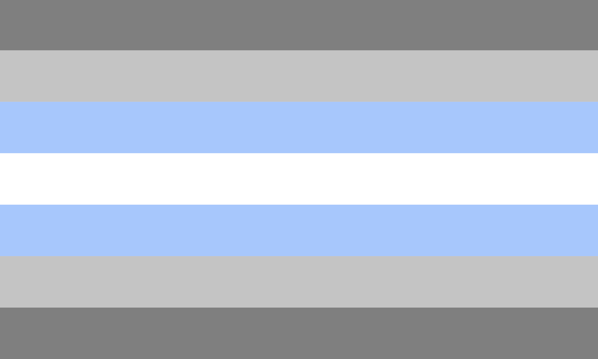

# Demi-boy Pride in GitHub Repository Languages

A demiboy is someone who partially identifies as a boy / man, regardless of their assigned gender at birth. 

This identity exists within the broader spectrum of gender identities and acknowledges that gender can be fluid & multifaceted. Demiboys may feel a strong connection to masculinity, but not to the extent of identifying fully as male. 

## Testing the programs

Executable programs that do little, but were crafted with love all the same!

Deep Grey: C

Light Grey: [Daslang](https://daslang.io/#news) 

- Daslang (former daScript) is a high-level programming language that features strong static typing. It is designed to provide high performance and serves as an embeddable 'scripting' language for C++ applications that require fast and reliable performance, such as games or back end/servers. Additionally, it functions effectively as a standalone programming language.

- [Download DasLang](https://github.com/GaijinEntertainment/daScript)

- [Online Console](https://gaijinentertainment.github.io/try-dascript/)

Blue: Go

- [Online Go Console](https://go.dev/play/)

- [Go by Example](https://gobyexample.com/)

- [Go Time Package](https://pkg.go.dev/time)

White: Vala

White: 

## Prior Art

Idea shamelessly copied from [niveditn/non-binary](https://github.com/niveditn/non-binary) who shamelessly copied from [ticky/trans](https://github.com/ticky/trans) who shamelessly pinched it from [spacekookie/gay](https://github.com/spacekookie/gay)

## Reference

[ozh/github-colors](https://github.com/ozh/github-colors)